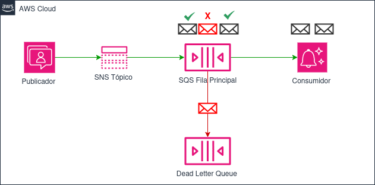
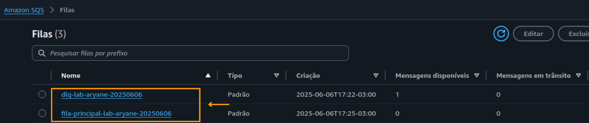
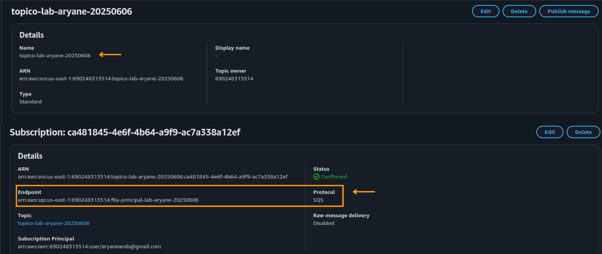
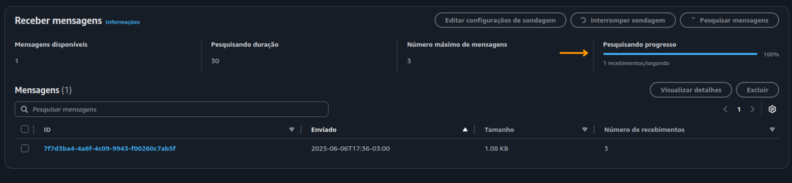
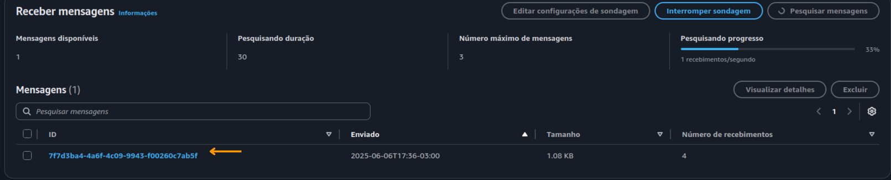

# ✉️ AWS Lab: Arquitetura de Mensageria com SNS, SQS e DLQ

Este repositório documenta a construção de uma arquitetura de mensageria baseada em serviços nativos da AWS, com foco em comunicação assíncrona, desacoplamento de microsserviços e tratamento inteligente de falhas.

O laboratório foi desenvolvido com abordagem prática de padrões cloud-native utilizando **Amazon SNS**, **Amazon SQS** e **Dead Letter Queue (DLQ)**.

---

## 🎯 Objetivo

Implementar uma arquitetura resiliente de mensageria para simular a comunicação entre microsserviços, garantindo desacoplamento, tolerância a falhas e confiabilidade no fluxo de dados.

---

## 🧰 Serviços AWS Utilizados

| Serviço        | Finalidade                                                                 |
|----------------|----------------------------------------------------------------------------|
| **Amazon SNS** | Distribuição de mensagens no modelo pub/sub (publisher → múltiplos consumers) |
| **Amazon SQS** | Fila durável para processamento assíncrono de mensagens                     |
| **DLQ**        | Isolamento de mensagens com falha para análise posterior                    |
| **AWS IAM**    | Controle de acesso seguro entre os serviços                                 |

---

## ⚙️ Etapas de Implementação

1. **Criação do tópico SNS**  
   - Configuração do canal de publicação para distribuição de mensagens.
2. **Criação da fila SQS padrão**  
   - Subscreve ao SNS e armazena mensagens para processamento assíncrono.
3. **Configuração da Dead Letter Queue (DLQ)**  
   - Definida como fallback para mensagens com falha de processamento.
4. **Criação de políticas IAM específicas**  
   - Garante integração segura e com princípio do menor privilégio.
5. **Envio e simulação de mensagens com erro**  
   - Teste completo do fluxo de falhas e análise na DLQ.

---

## ✅ Resultados Técnicos

- 🔁 **Desacoplamento eficaz** entre serviços produtores e consumidores  
- 🛡️ **Alta disponibilidade** com isolamento de falhas via DLQ  
- 🔄 **Retry automático** configurado na fila padrão  
- 🔍 **Observabilidade** das falhas com roteamento para análise posterior  
- 🔐 **Segurança reforçada** com permissões personalizadas no IAM  

---

## 🧪 Pré-requisitos

- Conta AWS com acesso ao Free Tier
- Permissões para criar SNS Topics, SQS Queues e políticas IAM
- Conhecimentos básicos em arquitetura de microsserviços e cloud-native

---

## 🧠 Boas Práticas Aplicadas

- Arquitetura assíncrona para evitar acoplamento direto entre componentes
- Uso de DLQ para mitigar perda de mensagens críticas
- IAM configurado com políticas mínimas necessárias
- Testes manuais de falha para validação da DLQ

---

## 🖼️ Diagramas e Capturas de Tela

> 
- **Fluxo de Mensageria com SNS + SQS + DLQ**  
  

- **Configuração SQS: Fila Principal e Dead Letter Queue Provisionadas**  
  

- **Integração SNS-SQS: Assinatura da Fila Principal no Tópico Configurada**  
  
  
- **Fluxo Normal: Processamento de Mensagem na Fila Principal**  
  

- **Mensagem Transferida para DLQ após Falha**  
  

---

## 📄 Licença

Este laboratório tem fins **educacionais** e **não comerciais**.  
Distribuído livremente para estudo e aprendizado.  
© 2025 Aryane Andrade

---
